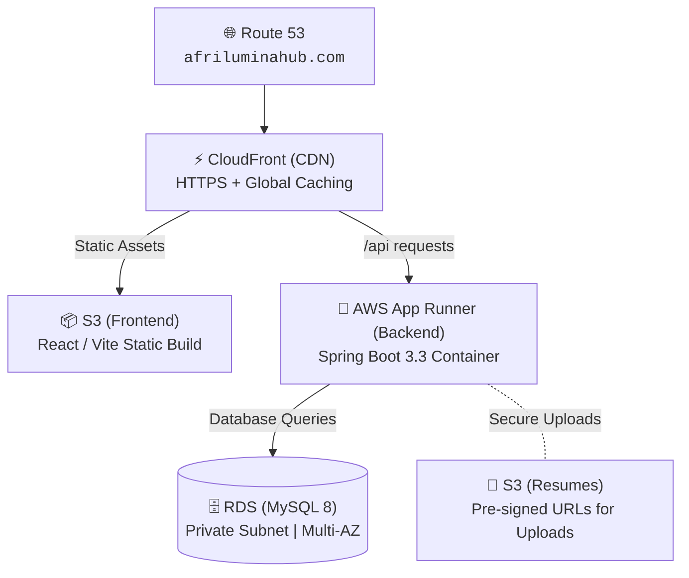

# AfriLumina Hub — Infrastructure

This directory contains Infrastructure as Code (IaC) for deploying AfriLumina Hub on AWS.

## Architecture Overview


## Services Used

| Service | Purpose |
|---------|---------|
| **S3** | Frontend static hosting + resume storage |
| **CloudFront** | CDN + SSL termination for frontend |
| **App Runner** | Containerized Spring Boot backend (serverless) |
| **RDS** | MySQL 8 database (private subnet) |
| **Route 53** | DNS management |
| **ACM** | SSL/TLS certificates |

## Prerequisites

- [Terraform](https://www.terraform.io/downloads) >= 1.0
- [AWS CLI](https://aws.amazon.com/cli/) configured with appropriate credentials
- An S3 bucket for Terraform state (create manually first)

## Quick Start

```bash
cd terraform

# Copy and fill in variables
cp terraform.tfvars.example terraform.tfvars

# Initialize Terraform
terraform init

# Plan the deployment
terraform plan

# Apply the infrastructure
terraform apply
```

## Directory Structure
```infrastructure/
├── terraform/          # Terraform IaC
│   ├── main.tf         # Main configuration
│   ├── variables.tf    # Input variables
│   ├── outputs.tf      # Output values
│   ├── providers.tf    # Provider and backend config
│   ├── vpc.tf          # Networking
│   ├── rds.tf          # Database
│   ├── apprunner.tf    # App Runner service
│   ├── s3.tf           # S3 buckets
│   ├── cloudfront.tf   # CDN distribution
│   ├── iam.tf          # IAM roles/policies
│   └── terraform.tfvars.example
├── cloudformation/     # CloudFormation alternative
└── README.md
```
